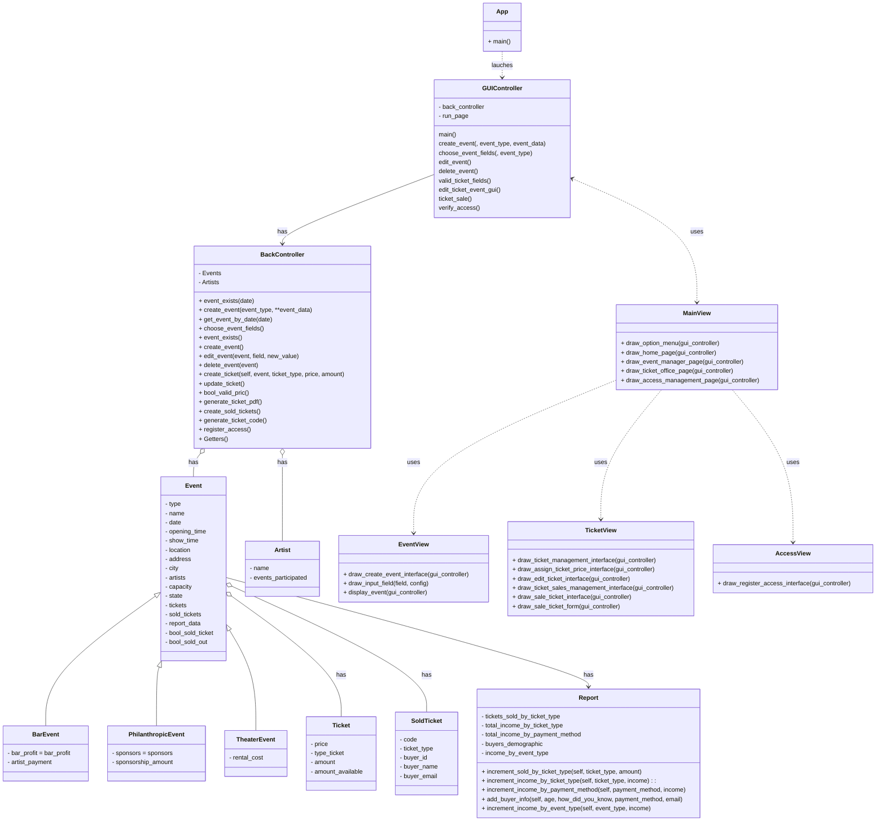

# GestionBoletasComedia

## Descripción

Este proyecto es un sistema de gestión de eventos de comedia. El sistema permite la creación de eventos, la gestión 
de boletas y la generación de reportes.

Este proyecto fue desarrollado para el curso de Programación Orientada a Objetos de la Universidad Javeriana Cali
donde se buscaba aplicar los conceptos de POO en un proyecto de software real desarrollado con el framework stremlit.

## Tabla de Contenidos
- [Explicación](#explicación)
- [Instalación](#instalación)
- [Uso](#uso)
- [Contribución](#contribución)
- [Código de Conducta](#código-de-conducta)
- [Licencia](#licencia)
- [Contacto](#contacto)
- [Agradecimientos](#agradecimientos)

## Explicación
### Humor hub
La solucion fue llamada Humor hub, un sistema de gestion de eventos de comedia. El sistema permite la creación de eventos, la gestión de boletas y la generación de reportes.

Los tipos de evento manejados son: BarEvent, PhilanthropicEvent y TheaterEvent. Cada uno de estos eventos tiene atributos y comportamientos específicos
sus campos se manejan en el archivo settings y se pueden modificar para adaptarse a las necesidades del usuario.

### Creación de eventos
El sistema permite la creación de eventos de comedia. Para crear un evento se debe ingresar la información requerida por el sistema.
El sistema valida que la información ingresada sea correcta y que no exista un evento con la misma fecha.
Tambien se pueden editar y eliminar eventos.

### Gestión de boletas
El sistema permite la creación de boletas para los eventos. Se pueden asignar precios a las boletas y se pueden vender boletas.
El sistema valida que la información ingresada sea correcta y que no se vendan boletas de más.
Tambien se pueden editar y eliminar boletas.

### Venta de boletas
El sistema permite la venta de boletas para los eventos. Se pueden vender boletas de diferentes tipos y se pueden vender varias boletas a la vez.
El sistema valida que la información ingresada sea correcta y que no se vendan boletas de más.
Tambien se pueden editar y eliminar boletas.

### Registro de acceso
El sistema permite el registro de acceso de los compradores a los eventos. Se puede registrar el acceso de un comprador a un evento.
El sistema valida que la información ingresada sea correcta y que no se registre el acceso de un comprador más de una vez.

### Reportes
El sistema permite la generación de reportes de los eventos. Se pueden generar reportes de los eventos vendidos, los ingresos por tipo de boleta, los ingresos por tipo de evento, los ingresos por método de pago y la demografía de los compradores.

### Diagrama de clases

## Instalación
* Instalar el proyecto en su computador local. Escriba desde la línea de comandos y ubicado en la carpeta raíz del
  proyecto `pip install -r requirements.txt`. Note que si no tiene un ambiente virtual primero debe configurarlo.
* Ejecutar el juego localmente. Escriba en consola `streamlit run app.py`. Su navegador debería abrir el juego

## Uso

En cuanto al uso puedes consultar este manuel de usuario [Manual de usuario](docs/Manual%20de%20usuario.pdf)

## Contacto

Si tienes alguna pregunta o comentario sobre este proyecto, no dudes en contactarme:

- **GitHub**: [Jdavidrb](https://github.com/Jdavidrb)
- **Correo Personal**: u.jdavidrb@gmail.com
- **Correo Institucional**: jdavidruanob@javerianacali.edu.co
- **Número de Contacto**: 3126498666

